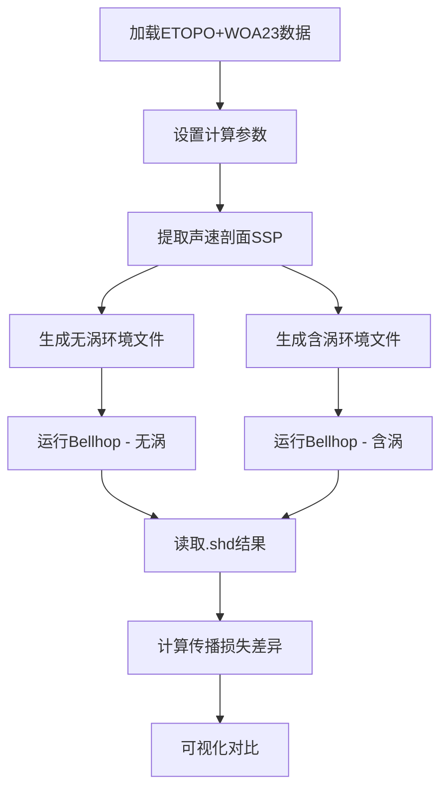

# EddyComparison.m 使用说明

## 功能
对比涡旋对水声传播的影响，生成含涡和不含涡的环境文件，运行Bellhop计算传播损失并可视化差异。

## 主要流程



## 输出文件

**位置**: `C:\DataBase\code\matlab\UASignalAugmentor\Plot\eddy\`

### 环境文件
- `NoEddy.env` - 无涡Bellhop环境文件
- `NoEddy.bty` - 无涡海底地形
- `NoEddy.ssp` - 无涡声速剖面
- `WithEddy.env` - 含涡Bellhop环境文件  
- `WithEddy.bty` - 含涡海底地形
- `WithEddy.ssp` - 含涡声速剖面

### 计算结果
- `NoEddy.shd` - 无涡传播损失结果
- `WithEddy.shd` - 含涡传播损失结果

### 可视化
- `EddyComparison.png` - 四子图对比（无涡TL / 含涡TL / 差异 / 声速剖面）

## 可调参数

### 基本参数（第30-46行）
```matlab
timeIdx = 13;           % 时间索引 (13-16:季节, 17:年平均)
coordS.lon = 115;       % 声源经度 (°E)
coordS.lat = 13;        % 声源纬度 (°N)
azi = 0;                % 方位角 (°)
rmax = 200;             % 最大距离 (km)
dr = 1;                 % 距离间隔 (km)
freq = 100;             % 频率 (Hz)
src_depth = 50;         % 声源深度 (m)
rcv_depth = 0:10:1000;  % 接收器深度 (m)
```

### 涡旋参数（第48-53行）
```matlab
eddy_params.rc = 100;   % 涡心水平位置 (km)
eddy_params.zc = 600;   % 涡心深度 (m)
eddy_params.DR = 70;    % 水平尺度 (km)
eddy_params.DZ = 400;   % 竖直尺度 (m)
eddy_params.DC = -40;   % 强度 (m/s, 负值=冷涡, 正值=暖涡)
```

## 使用示例

### 基本运行
```matlab
% 在MATLAB中运行
run EddyComparison.m
```

### 修改涡旋强度对比
```matlab
% 修改第52行涡旋强度
eddy_params.DC = -60;   % 增强冷涡强度
```

### 修改涡旋位置
```matlab
% 修改第48行涡心位置
eddy_params.rc = 150;   % 将涡心移至150km处
```

## 注意事项

1. **依赖项**:
   - 需要 `ETOPO2022.mat` 和 `woa23_*.mat` 数据文件
   - 需要 `bellhop.exe` 在 `../CallBell/` 目录下
   - 需要 `read_shd` 函数（自动从 `underwateracoustic` 路径加载）

2. **计算时间**:
   - 单次运行约1-3分钟（取决于网格分辨率）
   - Bellhop计算占用主要时间

3. **内存需求**:
   - 基本配置约需200-500MB内存
   - 增大距离范围或深度分辨率会增加内存需求

## 结果解读

### 传播损失差异图（子图3）
- **红色区域**（正值）：含涡后传播损失增大，信号衰减更强
- **蓝色区域**（负值）：含涡后传播损失减小，信号传播增强
- **零值区域**：涡旋影响可忽略

### 典型现象
- **声影区扩展**：冷涡会使声线向下折射，扩大声影区
- **汇聚区偏移**：涡旋改变声速结构，导致汇聚区位置偏移
- **能量聚集/发散**：涡旋边缘声速梯度变化引起声线聚焦或发散

## 代码结构

```
EddyComparison.m
├── 初始化 (L17-30)
├── 加载数据 (L37-40)
├── 设置参数 (L42-60)
├── 提取SSP (L66-70)
├── 生成环境文件 (L72-83)
│   └── create_bellhop_env() (L179-236)
├── 运行Bellhop (L85-97)
├── 读取结果 (L99-109)
└── 可视化 (L111-165)
```

## 扩展建议

### 参数扫描
```matlab
% 批量测试不同涡旋强度
DC_values = [-60, -40, -20, 0, 20, 40, 60];
for i = 1:length(DC_values)
    eddy_params.DC = DC_values(i);
    % ... 运行计算
end
```

### 添加内波对比
修改 `add_mesoscale` 调用，使用 `'internal_wave'` 模式

### 多频率对比
在外层添加频率循环：
```matlab
freq_list = [50, 100, 200, 500];
for freq = freq_list
    % ... 运行计算
end
```

---

**文档版本**: 1.0  
**最后更新**: 2025-12-12  
**维护者**: 猫猫头
